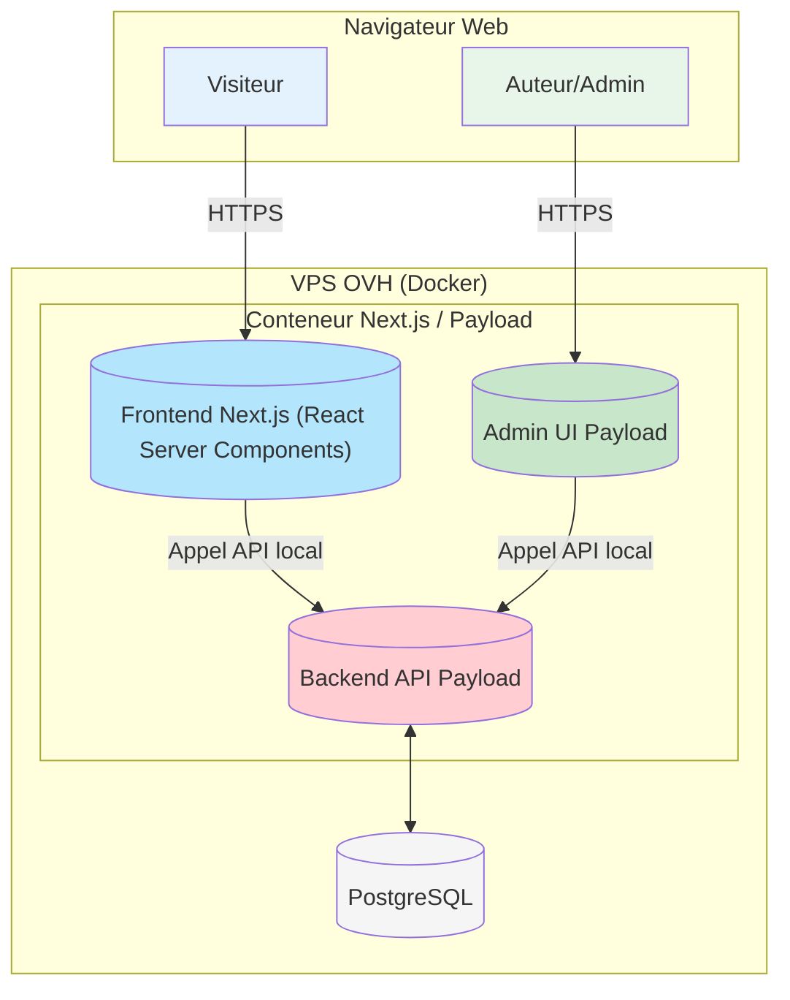

# Architecture de Haut Niveau

Cette section établit les fondations de l'architecture de `sebc.dev`, en définissant la structure globale, la plateforme, l'organisation du code et les patrons de conception qui guideront le développement.

## Résumé Technique

L'architecture de `sebc.dev` est conçue comme un système **full-stack unifié** basé sur NextJS 15, intégrant le CMS headless Payload 3 directement en son sein. Cette approche "headless intégrée" permet au frontend Next.js de consommer les données du backend Payload via une API locale pour une performance maximale. Le tout sera conteneurisé avec Docker et déployé sur un VPS OVH. Cette pile technologique a été choisie pour atteindre les objectifs de performance (scores Lighthouse \> 90), de qualité et de maîtrise des coûts, tout en offrant une expérience de développement moderne et efficace.

## Plateforme et Choix d'Infrastructure

Le choix de la plateforme est déjà défini dans le brief du projet et est non négociable.

- **Plateforme :** Serveur Privé Virtuel (VPS) chez OVH.
- **Spécifications :** 2 vCores, 8Go RAM, 80Go disque, OS Debian.
- **Services Clés :** Docker pour la conteneurisation, PostgreSQL pour la base de données.
- **Raisonnement :** Ce choix privilégie le contrôle total, la maîtrise du budget (en utilisant des solutions open-source et auto-hébergées) et évite la dépendance à un fournisseur cloud spécifique ("vendor lock-in"). La configuration matérielle est largement suffisante pour un blog technique, même avec une audience croissante.

## Structure du Dépôt (Repository)

Comme requis dans le PRD, la structure du projet sera un **Monorepo**.

- **Raisonnement :** L'intégration native et profonde de Payload 3 au sein d'un projet NextJS 15 rend le monorepo l'approche la plus logique et efficace. Elle simplifie la gestion des dépendances, le partage de types (TypeScript) entre le backend et le frontend, et unifie le processus de build et de déploiement. Des outils comme `npm/pnpm/yarn workspaces` seront utilisés pour gérer les différents paquets au sein du monorepo.

## Diagramme d'Architecture de Haut Niveau

Ce diagramme illustre les principaux composants du système et leurs interactions.

## Patrons Architecturaux et de Conception

- **CMS Headless Intégré :** Le patron principal est celui d'un CMS "headless" où Payload gère le contenu, mais il est directement intégré dans l'application Next.js qui sert de "tête" (le front-end). Cela garantit des performances optimales en évitant les appels réseau externes pour récupérer le contenu.
- **Architecture Orientée Composants (Frontend) :** Le frontend sera construit en utilisant des composants React (RSC - React Server Components), favorisant la réutilisabilité et la maintenabilité.
- **Repository Pattern (Backend) :** Payload CMS abstrait l'accès aux données via sa propre API, qui suit un modèle de conception similaire au "Repository Pattern", découplant la logique métier de la source de données.
