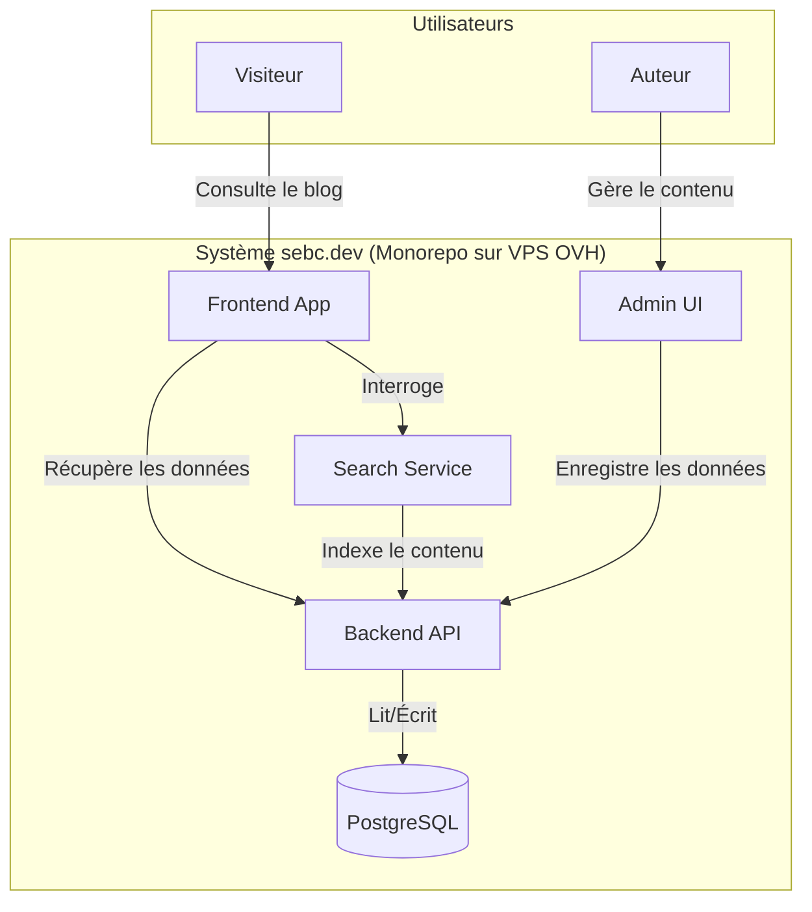

# Composants

Basé sur l'architecture unifiée choisie (Next.js + Payload), le système peut être divisé en plusieurs composants logiques distincts, chacun ayant un rôle clair.

## Frontend App (Next.js)

- **Responsabilité :** Afficher l'intégralité du site public. Cela inclut le rendu de la page d'accueil, des pages d'articles, des pages de listage (par catégorie/tag), des pages statiques ("À Propos", "Contact") et de la page de recherche. Ce composant est responsable de l'expérience utilisateur du lecteur.
- **Interfaces Clés :**
  - Expose des pages web aux navigateurs des visiteurs via le protocole HTTPS.
  - Consomme l'API de Payload en interne (côté serveur via les React Server Components) pour récupérer le contenu.
- **Dépendances :** Dépend entièrement du `Backend API (Payload)` pour tout le contenu.
- **Technologies :** Next.js 15, React 19, TailwindCSS 4, Shadcn/UI.

## Backend API (Payload CMS)

- **Responsabilité :** Servir de moteur de contenu pour l'ensemble du projet. Il gère la logique métier, la validation des données, l'authentification des administrateurs et la communication avec la base de données. Il est le cœur fonctionnel du CMS.
- **Interfaces Clés :**
  - Expose une API locale (REST et GraphQL) qui est consommée par le `Frontend App` et l'`Admin UI`.
  - Se connecte à la base de données PostgreSQL pour la persistance des données.
- **Dépendances :** Dépend du `Database (PostgreSQL)`.
- **Technologies :** Payload 3, TypeScript.

## Admin UI (Payload CMS)

- **Responsabilité :** Fournir l'interface d'administration web pour l'auteur. C'est ici que tout le contenu (articles, pages, catégories, tags, médias) sera créé, édité, traduit et publié.
- **Interfaces Clés :**
  - Une application web sécurisée, généralement accessible via une route dédiée (ex: `/admin`).
  - Communique exclusivement avec le `Backend API (Payload)`.
- **Dépendances :** Dépend entièrement du `Backend API (Payload)`.
- **Technologies :** React (intégré nativement dans Payload).

## Search Service (Plugin Payload)

- **Responsabilité :** Gérer l'indexation du contenu des articles et fournir une fonctionnalité de recherche performante, comme requis dans le périmètre du MVP.
- **Interfaces Clés :**
  - Expose un endpoint d'API de recherche (ex: `/api/search`) que le `Frontend App` interrogera.
  - S'intègre au cycle de vie du `Backend API (Payload)` pour indexer le contenu lors des sauvegardes.
- **Dépendances :** Dépend du `Backend API (Payload)` pour accéder au contenu à indexer.
- **Technologies :** Le plugin de recherche officiel `payload-search-plugin`, qui utilisera la base de données PostgreSQL pour l'indexation afin de minimiser les dépendances externes.

## Database (PostgreSQL)

- **Responsabilité :** Assurer la persistance de toutes les données de l'application : articles, pages, utilisateurs (auteurs), taxonomies, et métadonnées des médias.
- **Interfaces Clés :** Accepte les connexions SQL provenant exclusivement du `Backend API (Payload)`.
- **Dépendances :** Aucune, c'est la couche de persistance fondamentale.
- **Technologies :** PostgreSQL 16.x.

## Diagrammes des Composants

Ce diagramme C4-style illustre comment ces composants logiques interagissent au sein du système.

Bien. Passons à la modélisation des flux de travail principaux de l'application.
