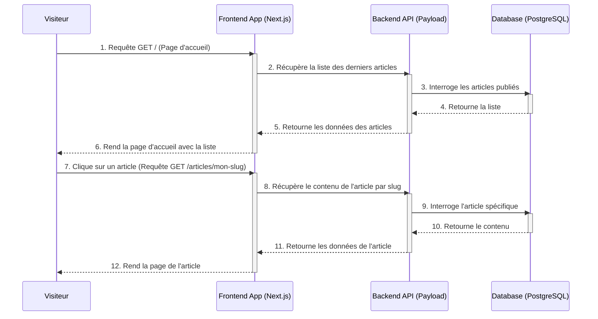
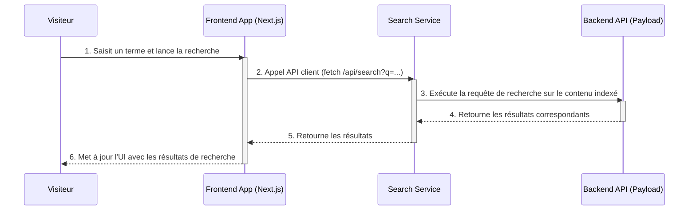

# Flux de Travail Principaux (Core Workflows)

Cette section utilise des diagrammes de séquence pour illustrer les interactions entre les composants du système lors des parcours utilisateurs critiques identifiés dans les spécifications. Ces diagrammes clarifient comment les données circulent et comment les responsabilités sont réparties.

## 1\. Lecture d'un article (Parcours Lecteur)

Ce flux décrit comment un visiteur navigue depuis la page d'accueil jusqu'à la lecture d'un article spécifique. Il met en évidence l'utilisation des Server-Side Rendering (SSR) ou Static Site Generation (SSG) de Next.js pour des performances optimales.



## 2\. Recherche d'un article (Parcours Lecteur)

Ce flux montre comment un visiteur utilise la fonctionnalité de recherche. L'interaction se fait côté client pour une expérience réactive, interrogeant un endpoint d'API dédié qui utilise le service de recherche.



## 3\. Publication d'un nouvel article (Parcours Auteur)

Ce flux décrit le processus de création et de publication de contenu par l'auteur via l'interface d'administration sécurisée de Payload.

```mermaid
sequenceDiagram
    participant A as Auteur
    participant ADM as Admin UI (Payload)
    participant API as Backend API (Payload)
    participant DB as Database (PostgreSQL)
    participant Search as Search Service

    A->>ADM: 1. Se connecte à /admin
    activate ADM
    ADM->>API: 2. Valide les identifiants
    activate API
    API<->>DB: 3. Vérifie l'utilisateur
    API-->>ADM: 4. Ouvre une session sécurisée
    deactivate API
    ADM-->>A: 5. Affiche le tableau de bord
    deactivate ADM

    A->>ADM: 6. Crée un nouvel article et sauvegarde
    activate ADM
    ADM->>API: 7. Requête POST /api/posts avec le contenu
    activate API
    API->>DB: 8. Valide et insère les données de l'article
    activate DB
    DB-->>API: 9. Confirme l'enregistrement
    deactivate DB
    API-->>Search: 10. Déclenche l'indexation du nouvel article (async)
    API-->>ADM: 11. Confirme la création
    deactivate API
    ADM-->>A: 12. Affiche un message de succès
    deactivate ADM
```
