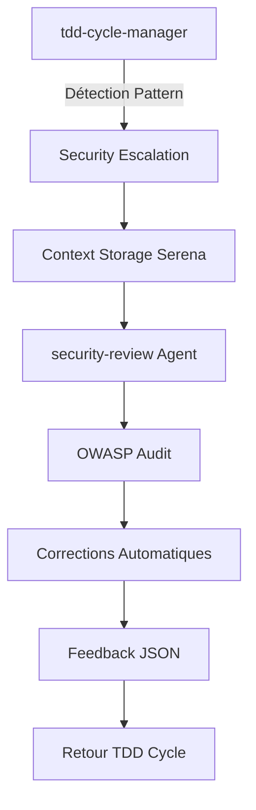

# Escalation Playbooks - Procédures Sécurité

Procédures d'escalade depuis **tdd-cycle-manager** vers **security-review** avec workflows automatisés.

## 🔄 Architecture d'Escalade

### Flow Principal



### Context Isolation

L'escalade maintient **l'isolation contextuelle** :

- **tdd-cycle-manager** : Continue le développement
- **security-review** : Audit indépendant et objectif
- **Serena Memory** : Interface de communication

## 🚨 Triggers d'Escalade Automatique

### 1. Pattern Detection

```typescript
// tdd-cycle-manager integration
const securityPatterns = [
  // Authentication patterns
  /auth|login|jwt|session|password|token/i,

  // Payment patterns
  /payment|stripe|billing|checkout|credit|card/i,

  // File upload patterns
  /upload|file|image|media|attachment/i,

  // Authorization patterns
  /admin|role|permission|access|rbac/i,

  // Database patterns (Payload)
  /payload\.find.*where.*\$/i,
  /\$like|\$in|\$ne|\$gt|\$lt/i,

  // Security headers
  /cors|csrf|xss|header|csp/i,

  // External integrations
  /fetch|axios|webhook|api\./i,
]

export const detectSecurityPatterns = (code: string): string[] => {
  const detected = []

  securityPatterns.forEach((pattern, index) => {
    if (pattern.test(code)) {
      detected.push({
        pattern: pattern.source,
        type: getPatternType(index),
        severity: getPatternSeverity(index),
      })
    }
  })

  return detected
}
```

### 2. Code Change Analysis

```typescript
// Dans tdd-cycle-manager
export const analyzeCodeChanges = async (diff: string, files: string[]) => {
  const securityFiles = ['middleware.ts', 'auth/', 'api/', 'payload.config.ts', 'next.config.js']

  const hasSecurityFiles = files.some((file) =>
    securityFiles.some((pattern) => file.includes(pattern)),
  )

  const hasSecurityPatterns = detectSecurityPatterns(diff).length > 0

  if (hasSecurityFiles || hasSecurityPatterns) {
    return await triggerSecurityEscalation({
      type: 'code_change',
      files,
      patterns: detectSecurityPatterns(diff),
      diff: diff.substring(0, 2000), // Limite pour Serena
    })
  }

  return null
}
```

## 📝 Escalation Procedures

### Procedure 1: Authentication Implementation

```typescript
// Playbook: Authentication Security Review
export const authEscalationPlaybook = {
  trigger: 'JWT|auth|login|session',

  async execute(context: EscalationContext) {
    // 1. Store context in Serena
    await mcp__serena__write_memory(`auth-escalation-${context.taskId}`, {
      type: 'authentication',
      implementation: context.implementation,
      files_modified: context.files,
      test_results: context.testResults,
      timestamp: Date.now(),
    })

    // 2. Delegate to security-review
    const securityResult = await Task({
      subagent_type: 'security-review',
      description: 'Auth security audit',
      prompt: `Audit sécurité de l'implémentation d'authentification.
      
Context: ${context.taskId}
Plan: ${context.planId}
Focus: JWT tokens, session management, password hashing
Files: ${context.files.join(', ')}

Référence: @docs/security/auth-patterns.md
Checklist: @docs/security/owasp-checklist.md A02,A07

Retour attendu: JSON avec status APPROVED|CONDITIONAL|BLOCKED`,
    })

    // 3. Process feedback
    return await processSecurityFeedback(securityResult, context)
  },
}
```

### Procedure 2: Payment Integration

```typescript
// Playbook: Payment Security Review
export const paymentEscalationPlaybook = {
  trigger: 'stripe|payment|billing|checkout',

  async execute(context: EscalationContext) {
    await mcp__serena__write_memory(`payment-escalation-${context.taskId}`, {
      type: 'payment_integration',
      provider: context.provider || 'stripe',
      endpoints: context.endpoints,
      webhooks: context.webhooks,
      timestamp: Date.now(),
    })

    const securityResult = await Task({
      subagent_type: 'security-review',
      description: 'Payment security audit',
      prompt: `Audit sécurité de l'intégration paiement.
      
Context: ${context.taskId}
Provider: ${context.provider}
Endpoints: ${context.endpoints?.join(', ')}

Focus: PCI DSS compliance, webhook security, data handling
Référence: @docs/security/payload-security.md

Vérifications critiques:
- Pas de stockage données carte
- Webhooks avec signature validation
- HTTPS obligatoire
- Logs sécurisés (sans PII)

Retour JSON attendu avec compliance PCI`,
    })

    return await processSecurityFeedback(securityResult, context)
  },
}
```

### Procedure 3: File Upload Security

```typescript
// Playbook: Upload Security Review
export const uploadEscalationPlaybook = {
  trigger: 'upload|file|media|attachment',

  async execute(context: EscalationContext) {
    await mcp__serena__write_memory(`upload-escalation-${context.taskId}`, {
      type: 'file_upload',
      collections: context.collections,
      file_types: context.fileTypes,
      size_limits: context.sizeLimits,
      timestamp: Date.now(),
    })

    const securityResult = await Task({
      subagent_type: 'security-review',
      description: 'Upload security audit',
      prompt: `Audit sécurité du système d'upload de fichiers.
      
Context: ${context.taskId}
Collections: ${context.collections?.join(', ')}
Types autorisés: ${context.fileTypes?.join(', ')}

Focus: 
- Validation MIME types
- Vérification signatures fichiers
- Limites taille
- Noms fichiers sécurisés
- Scan antivirus

Référence: @docs/security/templates/corrections.md (Upload Sécurisé)

Retour JSON avec vulnérabilités upload`,
    })

    return await processSecurityFeedback(securityResult, context)
  },
}
```

## 🔄 Feedback Processing

### Format de Retour Standardisé

```typescript
interface SecurityFeedback {
  status: 'APPROVED' | 'CONDITIONAL' | 'BLOCKED'
  critical_issues: CriticalIssue[]
  fixes_applied: AppliedFix[]
  tests_required: RequiredTest[]
  compliance_score: number // 0-100
  next_actions: NextAction[]
  owasp_coverage: {
    [key: string]: 'PASS' | 'FAIL' | 'WARNING'
  }
}

interface CriticalIssue {
  id: string
  severity: 'CRITICAL' | 'HIGH' | 'MEDIUM' | 'LOW'
  owasp_category: string // A01, A02, etc.
  description: string
  file: string
  line?: number
  recommendation: string
}
```

### Processing Logic

```typescript
export const processSecurityFeedback = async (
  feedback: SecurityFeedback,
  context: EscalationContext,
) => {
  // Store feedback in Serena
  await mcp__serena__write_memory(`security-feedback-${context.taskId}`, feedback)

  switch (feedback.status) {
    case 'APPROVED':
      return {
        action: 'CONTINUE_TDD',
        message: `✅ Security audit passed (${feedback.compliance_score}% OWASP compliance)`,
        next_phase: 'REFACTOR',
      }

    case 'CONDITIONAL':
      return {
        action: 'APPLY_FIXES',
        message: `⚠️ Security issues found - applying ${feedback.fixes_applied.length} fixes`,
        fixes: feedback.fixes_applied,
        retest_required: true,
        next_phase: 'SECURITY_RETEST',
      }

    case 'BLOCKED':
      return {
        action: 'STOP_DEVELOPMENT',
        message: `🚨 Critical security issues - development blocked`,
        critical_count: feedback.critical_issues.length,
        required_actions: feedback.next_actions,
        next_phase: 'SECURITY_FIXES',
      }
  }
}
```

## 🎯 TDD Integration Patterns

### Green → Security Check → Refactor

```typescript
// Dans tdd-cycle-manager après phase GREEN
export const securityCheckpoint = async (context: TDDContext) => {
  const codeChanges = await git.diff('HEAD~1', 'HEAD')
  const securityTriggers = detectSecurityPatterns(codeChanges)

  if (securityTriggers.length > 0) {
    console.log(`🛡️ Security patterns detected: ${securityTriggers.map((t) => t.type).join(', ')}`)

    const escalationResult = await escalateToSecurity({
      taskId: context.taskId,
      planId: context.planId,
      implementation: codeChanges,
      files: context.modifiedFiles,
      triggers: securityTriggers,
    })

    switch (escalationResult.action) {
      case 'CONTINUE_TDD':
        console.log('✅ Security validation passed - proceeding to REFACTOR')
        return { nextPhase: 'REFACTOR' }

      case 'APPLY_FIXES':
        console.log('⚠️ Applying security fixes before REFACTOR')
        await applySecurityFixes(escalationResult.fixes)
        return { nextPhase: 'SECURITY_RETEST' }

      case 'STOP_DEVELOPMENT':
        console.log('🚨 Critical security issues - stopping TDD cycle')
        return { nextPhase: 'BLOCKED', reason: 'security' }
    }
  }

  return { nextPhase: 'REFACTOR' }
}
```

### Manual Security Escalation

```typescript
// Commande manuelle dans tdd-cycle-manager
export const manualSecurityReview = async (focus?: string) => {
  const context = await getCurrentTDDContext()

  const escalationResult = await Task({
    subagent_type: 'security-review',
    description: 'Manual security review',
    prompt: `Audit sécurité manuel demandé.
    
Context: ${context.taskId}
Focus: ${focus || 'general'}
Current implementation: ${context.currentPhase}

Effectuer audit complet OWASP sur l'implémentation actuelle.
Référence: @docs/security/

Retour JSON avec recommandations détaillées.`,
  })

  return await processSecurityFeedback(escalationResult, context)
}
```

## 📊 Escalation Metrics

### Performance Tracking

```typescript
interface EscalationMetrics {
  total_escalations: number
  auto_triggered: number
  manual_triggered: number

  outcomes: {
    approved: number
    conditional: number
    blocked: number
  }

  avg_audit_time: number // milliseconds
  compliance_scores: number[] // Pour moyenne

  patterns_detected: {
    [pattern: string]: number
  }

  fixes_applied: {
    [fix_type: string]: number
  }
}

export const trackEscalation = async (
  type: string,
  outcome: string,
  duration: number,
  compliance: number,
) => {
  const metrics = await getEscalationMetrics()

  metrics.total_escalations++
  metrics.outcomes[outcome]++
  metrics.avg_audit_time = (metrics.avg_audit_time + duration) / 2
  metrics.compliance_scores.push(compliance)

  await saveEscalationMetrics(metrics)
}
```

## 🔧 Configuration d'Escalade

### Environment Variables

```bash
# Security escalation settings
SECURITY_AUTO_ESCALATION=true
SECURITY_MIN_COMPLIANCE=85
SECURITY_BLOCK_CRITICAL=true
SECURITY_AUDIT_TIMEOUT=120000  # 2 minutes

# Notification settings (optionnel)
SECURITY_SLACK_WEBHOOK=""
SECURITY_EMAIL_ALERTS=""
```

### Escalation Rules

```typescript
// config/security-escalation.ts
export const escalationConfig = {
  auto_triggers: {
    enabled: process.env.SECURITY_AUTO_ESCALATION === 'true',
    patterns: securityPatterns,
    file_patterns: ['middleware.ts', 'auth/**', 'api/**', '**/*auth*', '**/*payment*'],
  },

  thresholds: {
    min_compliance: parseInt(process.env.SECURITY_MIN_COMPLIANCE || '85'),
    block_on_critical: process.env.SECURITY_BLOCK_CRITICAL === 'true',
    max_audit_time: parseInt(process.env.SECURITY_AUDIT_TIMEOUT || '120000'),
  },

  notifications: {
    slack_webhook: process.env.SECURITY_SLACK_WEBHOOK,
    email_alerts: process.env.SECURITY_EMAIL_ALERTS?.split(',') || [],
  },
}
```

---

## ✅ Escalation Checklist

### Setup Validation

- [ ] Patterns de détection configurés
- [ ] Agent security-review fonctionnel
- [ ] Documentation security/ accessible
- [ ] Serena memory writing/reading OK
- [ ] Context isolation maintenu

### Integration Tests

- [ ] Escalation automatique sur auth code
- [ ] Escalation manuelle fonctionnelle
- [ ] Feedback JSON parsing correct
- [ ] Retour TDD cycle working
- [ ] Fixes automatiques appliquées

### Performance Validation

- [ ] Audit complet < 2 minutes
- [ ] Memory usage stable
- [ ] Context switching smooth
- [ ] Error handling robust

---

_Escalation Playbooks - Intégration TDD → Security_
