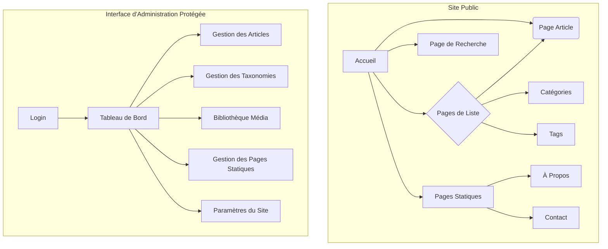

# Spécification UI/UX : sebc.dev (Version Finale)

## 1\. Objectifs et Principes Généraux de l'UX

### 1.1 Personas Cibles

* **Utilisateur Principal : Le Développeur Professionnel (Lecteur)**
* **Utilisateur Secondaire : L'Auteur (Administrateur)**

### 1.2 Objectifs d'Utilisabilité

* **Lisibilité Exceptionnelle :** Le contenu doit être facile à lire sur tous les appareils.
* **Découvrabilité Efficace :** Les lecteurs doivent trouver l'information rapidement via la navigation ou la recherche.
* **Efficacité Administrative :** L'interface d'administration doit être optimisée pour la rapidité.
* **Accessibilité Inclusive :** Le site doit être conforme au standard WCAG 2.1 AA.

### 1.3 Principes de Conception

1.  **Le Contenu avant tout ("Content First") :** Le design doit servir et améliorer la lisibilité du contenu.
2.  **Simplicité et Minimalisme :** L'interface sera épurée pour éviter toute distraction.
3.  **Cohérence Visuelle :** L'identité visuelle sera appliquée de manière rigoureuse.
4.  **Performance par Conception ("Performance by Design") :** Chaque décision de design sera évaluée en fonction de son impact sur la performance.

## 2\. Architecture de l'Information (IA)

### 2.1 Plan du Site

### 2.2 Structure de Navigation

* **Navigation Principale (Header) :** `Articles`, `Catégories`, `À Propos`, `Contact`, Icône de recherche, Sélecteur de langue (FR/EN).
* **Fil d'Ariane (Breadcrumbs) :** Présent sur les pages internes pour aider à la navigation.

## 3\. Parcours Utilisateurs

* **Lire un article depuis l'accueil (Lecteur) :** Arrivée -\> Consultation de la liste -\> Clic sur un titre -\> Lecture de l'article.
* **Rechercher un article (Lecteur) :** Clic sur recherche -\> Saisie des mots-clés -\> Consultation des résultats -\> Clic sur un article.
* **Publier un nouvel article (Auteur/Admin) :** Connexion -\> Navigation vers la liste d'articles -\> Création, rédaction et sauvegarde -\> Publication.

## 4\. Wireframes & Mockups

La conception visuelle se fera dans **Figma**. La structure des pages clés est définie par les mockups ASCII validés :

* **Page d'accueil (Desktop) :** Section "héro" en pleine page avec le dernier article, suivie d'une grille des articles plus anciens.
* **Page d'accueil (Mobile) :** Pas de section "héro", le dernier article est le premier élément d'une grille unique.
* **Page d'article (Desktop) :** Mise en page à deux colonnes avec l'image en premier, et une table des matières fixe à droite.

## 5\. Bibliothèque de Composants / Design System

L'approche sera d'utiliser **Shadcn/UI**, en intégrant directement les composants nécessaires dans la codebase pour un contrôle et une personnalisation maximum.

## 6\. Identité Visuelle et Guide de Style

* **Personnalité :** Moderne et accessible.
* **Palette de Couleurs :** La palette est rigoureusement définie par les thèmes `dark-teal-neutral` (Sombre) et `light-blue` (Clair) que vous avez fournis, garantissant la cohérence et l'accessibilité.
* **Typographie :** **Inter** (titres, corps), **Jetbrains Mono** (code).
* **Iconographie :** **Lucide Icons** (`lucide-react`).
* **Espacement :** Standard de TailwindCSS (multiples de 4px).

## 7\. Exigences d'Accessibilité

* **Standard :** WCAG 2.1 AA.
* **Objectif :** Score Lighthouse \> 95.
* **Exigences clés :** Contrastes élevés, focus visible, navigation au clavier, HTML sémantique, textes alternatifs pour les images.

## 8\. Stratégie de Responsive Design

* **Approche :** Mobile-first.
* **Points de Rupture :** Standards de TailwindCSS (`sm`, `md`, `lg`, `xl`).
* **Patrons d'Adaptation :** Le menu de navigation devient un "hamburger" sur mobile ; la mise en page des pages d'accueil et d'article change radicalement entre mobile et bureau comme défini dans les mockups.

## 9\. Animations et Micro-interactions

* **Principes :** Subtilité, utilité, performance, et respect du `prefers-reduced-motion`.
* **Interactions :** Transitions douces au survol, fondus légers entre les pages, affichage progressif des éléments.

## 10\. Considérations de Performance

* **Objectifs :** Basés sur les Core Web Vitals (FCP \< 1.8s, INP \< 200ms, CLS \~ 0).
* **Stratégies :** Optimisation des images (WebP, lazy loading), chargement asynchrone des polices, minimalisme JavaScript.

## 11\. Prochaines Étapes

* **Actions Immédiates :** Créer les maquettes haute-fidélité dans Figma ; préparer la transition vers l'Architecte.
* **Checklist de Handoff :** Tous les points (parcours, composants, accessibilité, etc.) sont validés.